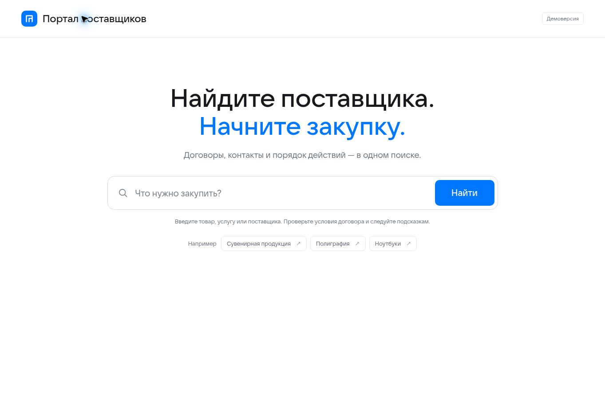

# Портал поставщиков

Интерактивный демонстрационный прототип Портала поставщиков для поиска договоров, контактов, инструкций.

[Открыть прототип](https://denisorionov.github.io/supplier-portal-prototype/)

## Демонстрационный функционал

1. На главной ввести ключевое слово или нажать на пример запроса.
2. Найти договоры, сравнить поставщиков, доступный лимит и сроки.
3. Переключить фильтр «Без предупреждений», изменить сортировку или страницу таблицы.
4. Выбрать договор и увидеть подсказки по оформлению заказа.
5. Открыть контакты поставщика, закупщика и сотрудника ГПБ.
6. Посмотреть пул поставщиков по найденной категории.
7. Нажать «Создать задачу в Jira» и увидеть заполненный макет задачи. Данные можно скопировать, но задача никуда не отправляется.
8. Ввести «мебель» и пройти сценарий, когда подходящего договора нет.

Примеры поиска: «сувениры», «мерч», «кружки», «полиграфия», «визитки», «ноутбуки», «мероприятия», «маркетинг», «БрендФабрика», «SU-1187». По запросу «маркетинг» видна постраничная таблица.

## Демонстрационные данные

Все компании, лица, суммы и контакты вымышлены. Адреса почты используют зарезервированную зону `.example`, телефоны — условный код `000`. Даты договоров вычисляются относительно даты просмотра в часовом поясе Москвы, чтобы сценарии предупреждений оставались наглядными при будущих презентациях. Дата среза указана под результатами.

- В выдаче только договоры, действующие на дату среза.
- Доступный лимит красный при остатке строго меньше 20% предельной цены.
- Срок красный, если до окончания остаётся строго меньше трёх календарных месяцев.
- Ровно 20% и ровно три месяца не вызывают предупреждение.
- Предупреждения дополнительно подписаны текстом и не зависят только от цвета.

Поиск работает с локальным набором примеров, поддерживает несколько слов и основные синонимы. Это демонстрация поведения поиска, не промышленная поисковая система. Запросы не отправляются на сервер и не сохраняются в браузере.

## Структура

- `index.html` — главный экран, результаты, инструкции и диалоги.
- `assets/portal.css` — адаптивный интерфейс и состояния.
- `assets/catalog.js` — вымышленные данные, поиск, фильтрация и календарные правила.
- `assets/portal.js` — взаимодействия и демонстрационные сценарии.
- `assets/fonts/` — локальные файлы гарнитуры из предоставленной визуальной системы; права на шрифты сохраняются за их правообладателями.
- `tests/catalog.test.cjs` — проверки поиска и граничных условий предупреждений.

Публикация: GitHub Pages, корень ветки `main`. Сборка и установка зависимостей не требуются.

Проверки: `node --test tests/catalog.test.cjs` и `node --check assets/portal.js`.

## Превью главного экрана

